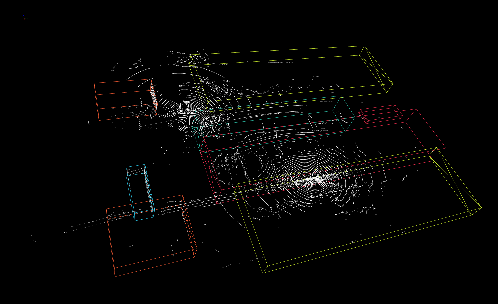

# TROUT
`TROUT` is a multi-modal data set of waterway traffic. This document provides how to use trout data set for 3d object detection training and evaluation. 

It is also the official code release of [`[PointRCNN]`](https://arxiv.org/abs/1812.04244), [`[Part-A2-Net]`](https://arxiv.org/abs/1907.03670), [`[PV-RCNN]`](https://arxiv.org/abs/1912.13192), [`[Voxel R-CNN]`](https://arxiv.org/abs/2012.15712), [`[PV-RCNN++]`](https://arxiv.org/abs/2102.00463) . 

**Highlights**: 
* `TROUT` has been published, (Jan. 2025)
* The code already supports generating test data info.
* The code already supports train, val, and test in `TROUT` dataset.


## Overview
- [Changelog](#changelog)
- [Model Zoo](#model-zoo)
- [Installation](#installation)
- [Getting Started](#GETTING-STARTED)
- [Citation](#citation)


## Changelog
[2025-01-19] `TROUT` v0.1.0 is released. 


## Introduction
The `TROUT` dataset contains the following specific attributes:
1) Data from the same location at different periods (including morning, noon, and afternoon) and different weather (including sunny, cloudy, and drizzly) scenarios;
2) 16000 frames of UAV image data, multi-LiDAR point cloud data, water depth data, etc. The real-time difference of the same frame data from different sensors is less than 0.1s;
3) 16000 frames of data of 85216 targets with detailed labeling information, including water level, 2D and 3D boxes of targets, and other labeling information.
The format of the dataset and annotation information is modeled after the Coco, Kitti, and PCDet_custom datasets, which is convenient for other researchers to get a better handle on the TROUT dataset and quickly conduct related research.
DATA at：[Coco_TROUT_data](https://drive.google.com/file/d/1mFQS-TTOR1sSjfPCuIeryK_LND2CLhk9/view?usp=sharing), [Kitti_TROUT_data](https://drive.google.com/file/d/1E5cQHYgv8s7pCfQyvnH2FvPhxDPe2lxb/view?usp=sharing), [PCDet_TROUT_data](https://drive.google.com/file/d/1JCClYd6egTm0AxXtW80L18AySgG45_og/view?usp=sharing).
<p align="center">
  
</p>

* Trout dataset coordinate system
<p align="center">
  
</p>

## Model Zoo

### TROUT 3D Object Detection Baselines
Selected supported methods are shown in the below table. The results are the 3D detection performance  on the ` test`  set of TROUT dataset.
* All models are trained with GTX 4080 GPU and are available for download. 
* The training time is measured with GTX 4080 GPU and PyTorch 1.13.
* 3D Intersection over Union (IoU) is 0.7.

|                                             | training time | Building@R40 | Fully_loaded_cargo_ship@R40 | Fully_loaded_container_ship@R40 | Lock_gate@R40 | Tree@R40 | Unloaded_cargo_ship@R40  | download | 
|---------------------------------------------|----------:|:-------:|:-------:|:-------:|:---------:|:-------:|:-------:|:---------:|
| [Part-A2](tools/cfgs/trout_models/PartA2.yaml)    | ~8.2 hours| 100.0 | 86.6 | 84.0 | 100.0 | 100.0 | 92.2 | [PartA2_trout_766M](https://drive.google.com/file/d/1PxH0ZSmAylBEMshZXqoei8ME0mNltjCz/view?usp=sharing) |
| [PointRCNN](tools/cfgs/trout_models/pointrcnn.yaml) | ~15.2 hours | 100.0 | 58.3 | 74.8 | 89.5 | 100.0 | 80.7 | [point_rcnn_trout_48M](https://drive.google.com/file/d/1BQOzg3bZ8ndFOF2fwvUxzAol3E0lhHon/view?usp=sharing)|
| [PointPillar](tools/cfgs/trout_models/pointpillar.yaml) |~12.2 hours| 100.0 | 15.1 | 0.0 | 64.1 | 100.0 | 1.8 | [pointpillar_trout_58M](https://drive.google.com/file/d/1GCA5jK84kNoOc2Ktl9C4n5XPWpQQkKKi/view?usp=sharing) | 
| [PV-RCNN](tools/cfgs/trout_models/pv_rcnn.yaml) | ~25.1 hours| 15.2 | 100.0 | 88.1 | 81.9 | 100.0 | 92.2 | [pv_rcnn_trout_158M](https://drive.google.com/file/d/1ZMkAuJGkkiawNI5-4aW6TDcR2O3Zwdx3/view?usp=sharing) |
| [SECOND](tools/cfgs/trout_models/second.yaml)       |  ~2.2 hours  | 100.0 | 49.0 | 60.5 | 73.9 | 100.0 | 67.5 | [second_trout_64M](https://drive.google.com/file/d/10RyxNjGQ2aYTX8n7Af7R5fyeqGqcNg_O/view?usp=sharing) |
| [Voxel R-CNN](tools/cfgs/trout_models/voxel_rcnn.yaml) | ~8.2 hours| 100.0 | 85.9 | 83.8 | 97.5 | 100.0 | 87.1 | [voxel_rcnn_trout_91M](https://drive.google.com/file/d/1-fy-GJypqFIW1H3NUXmo6ijScmRClrno/view?usp=sharing) |
|

## Installation
The installation process is the same as that for `PCDet`.If you have problems with installation, you can refer to our conda environment. Our GPU is RTX4080 and the operating system is ubuntu 20.04. 

Create and activate a conda environment.
```shell
conda create --name pcdet python=3.9 -y
conda activate pcdet
```

Install `PyTorch` based on the `PyTorch` official instructions.The cuda for our environment is 12.1, cuda for our environment is 11.8 and python is 3.9.
```shell
pip install torch==1.13.0 torchvision==0.14.0 torchaudio==0.13.0
```

Installation dependency.
```shell
pip install av2
pip install kornia==0.6.5
pip install numpy==1.24.3
```

```shell
git clone https://github.com/PCDet_trout.git
cd PCDet_trout/
pip install -r requirements.txt 
python setup.py develop
pip install open3d
```

Download the trained pv_rcnn model and place it in a folder. Verify that the installation is successful. If it is successful, You will see the following image in Open3D.

[pv_rcnn_trout_158M.pth](https://drive.google.com/file/d/1ZMkAuJGkkiawNI5-4aW6TDcR2O3Zwdx3/view?usp=sharing) 

```
PCDet_trout
├── pv_rcnn_trout_158M.pth

```

```shell
python demo.py --cfg_file ./cfgs/trout_models/pv_rcnn.yaml --ckpt ./pv_rcnn_trout_158M.pth --data_path ./data/TROUT/points_test/003513.bin
```
<p align="center">
  
</p>


### conda list
```
# packages in environment at /home/luxiaodong/miniconda3/envs/pcdet:
#
# Name                    Version                   Build  Channel
_libgcc_mutex             0.1                 conda_forge    https://mirrors.ustc.edu.cn/anaconda/cloud/conda-forge
_openmp_mutex             4.5                       2_gnu    https://mirrors.ustc.edu.cn/anaconda/cloud/conda-forge
addict                    2.4.0                    pypi_0    pypi
aiohappyeyeballs          2.4.4              pyhd8ed1ab_1    https://mirrors.ustc.edu.cn/anaconda/cloud/conda-forge
aiohttp                   3.11.11          py39h9399b63_0    https://mirrors.ustc.edu.cn/anaconda/cloud/conda-forge
aiosignal                 1.3.2              pyhd8ed1ab_0    https://mirrors.ustc.edu.cn/anaconda/cloud/conda-forge
alsa-lib                  1.2.13               hb9d3cd8_0    https://mirrors.ustc.edu.cn/anaconda/cloud/conda-forge
aom                       3.9.1                hac33072_0    https://mirrors.ustc.edu.cn/anaconda/cloud/conda-forge
apptools                  5.1.0              pyh44b312d_0    https://mirrors.ustc.edu.cn/anaconda/cloud/conda-forge
argcomplete               3.5.2                    pypi_0    pypi
asttokens                 3.0.0                    pypi_0    pypi
async-timeout             5.0.1              pyhd8ed1ab_1    https://mirrors.ustc.edu.cn/anaconda/cloud/conda-forge
attr                      2.5.1                h166bdaf_1    https://mirrors.ustc.edu.cn/anaconda/cloud/conda-forge
attrs                     24.3.0             pyh71513ae_0    https://mirrors.ustc.edu.cn/anaconda/cloud/conda-forge
av                        14.0.1                   pypi_0    pypi
av2                       0.2.1                    pypi_0    pypi
blas                      1.1                    openblas    https://mirrors.ustc.edu.cn/anaconda/cloud/conda-forge
blessed                   1.20.0                   pypi_0    pypi
blinker                   1.9.0                    pypi_0    pypi
blosc                     1.21.6               hef167b5_0    https://mirrors.ustc.edu.cn/anaconda/cloud/conda-forge
bzip2                     1.0.8                h4bc722e_7    https://mirrors.ustc.edu.cn/anaconda/cloud/conda-forge
c-ares                    1.34.4               hb9d3cd8_0    https://mirrors.ustc.edu.cn/anaconda/cloud/conda-forge
ca-certificates           2024.12.14           hbcca054_0    https://mirrors.ustc.edu.cn/anaconda/cloud/conda-forge
cairo                     1.18.2               h3394656_1    https://mirrors.ustc.edu.cn/anaconda/cloud/conda-forge
ccimport                  0.4.4                    pypi_0    pypi
certifi                   2024.12.14               pypi_0    pypi
charset-normalizer        3.4.0                    pypi_0    pypi
click                     8.1.7           unix_pyh707e725_1    https://mirrors.ustc.edu.cn/anaconda/cloud/conda-forge
cloudpickle               3.1.0              pyhd8ed1ab_1    https://mirrors.ustc.edu.cn/anaconda/cloud/conda-forge
colorlog                  6.9.0                    pypi_0    pypi
comm                      0.2.2                    pypi_0    pypi
configargparse            1.7                      pypi_0    pypi
configobj                 5.0.9              pyhd8ed1ab_1    https://mirrors.ustc.edu.cn/anaconda/cloud/conda-forge
contourpy                 1.3.0                    pypi_0    pypi
cumm-cu118                0.7.11                   pypi_0    pypi
cycler                    0.12.1                   pypi_0    pypi
cyrus-sasl                2.1.27               h54b06d7_7    https://mirrors.ustc.edu.cn/anaconda/cloud/conda-forge
cytoolz                   1.0.1            py39h8cd3c5a_0    https://mirrors.ustc.edu.cn/anaconda/cloud/conda-forge
dash                      2.18.2                   pypi_0    pypi
dash-core-components      2.0.0                    pypi_0    pypi
dash-html-components      2.0.0                    pypi_0    pypi
dash-table                5.0.0                    pypi_0    pypi
dask-core                 2024.8.0           pyhd8ed1ab_0    https://mirrors.ustc.edu.cn/anaconda/cloud/conda-forge
dav1d                     1.2.1                hd590300_0    https://mirrors.ustc.edu.cn/anaconda/cloud/conda-forge
dbus                      1.13.6               h5008d03_3    https://mirrors.ustc.edu.cn/anaconda/cloud/conda-forge
decorator                 5.1.1                    pypi_0    pypi
distlib                   0.3.9                    pypi_0    pypi
double-conversion         3.3.0                h59595ed_0    https://mirrors.ustc.edu.cn/anaconda/cloud/conda-forge
e                         1.4.5                    pypi_0    pypi
easydict                  1.13                     pypi_0    pypi
eigen                     3.4.0                h00ab1b0_0    https://mirrors.ustc.edu.cn/anaconda/cloud/conda-forge
elfutils                  0.192                h7f4e02f_1    https://mirrors.ustc.edu.cn/anaconda/cloud/conda-forge
envisage                  7.0.3              pyhff2d567_0    https://mirrors.ustc.edu.cn/anaconda/cloud/conda-forge
exceptiongroup            1.2.2                    pypi_0    pypi
executing                 2.1.0                    pypi_0    pypi
expat                     2.6.4                h5888daf_0    https://mirrors.ustc.edu.cn/anaconda/cloud/conda-forge
fastjsonschema            2.21.1                   pypi_0    pypi
ffmpeg                    6.1.2           gpl_h20f64c8_506    https://mirrors.ustc.edu.cn/anaconda/cloud/conda-forge
fftw                      3.3.10          nompi_hf1063bd_110    https://mirrors.ustc.edu.cn/anaconda/cloud/conda-forge
filelock                  3.16.1                   pypi_0    pypi
fire                      0.7.0                    pypi_0    pypi
flask                     3.0.3                    pypi_0    pypi
font-ttf-dejavu-sans-mono 2.37                 hab24e00_0    https://mirrors.ustc.edu.cn/anaconda/cloud/conda-forge
font-ttf-inconsolata      3.000                h77eed37_0    https://mirrors.ustc.edu.cn/anaconda/cloud/conda-forge
font-ttf-source-code-pro  2.038                h77eed37_0    https://mirrors.ustc.edu.cn/anaconda/cloud/conda-forge
font-ttf-ubuntu           0.83                 h77eed37_3    https://mirrors.ustc.edu.cn/anaconda/cloud/conda-forge
fontconfig                2.15.0               h7e30c49_1    https://mirrors.ustc.edu.cn/anaconda/cloud/conda-forge
fonts-conda-ecosystem     1                             0    https://mirrors.ustc.edu.cn/anaconda/cloud/conda-forge
fonts-conda-forge         1                             0    https://mirrors.ustc.edu.cn/anaconda/cloud/conda-forge
fonttools                 4.55.3                   pypi_0    pypi
freetype                  2.12.1               h267a509_2    https://mirrors.ustc.edu.cn/anaconda/cloud/conda-forge
fribidi                   1.0.10               h36c2ea0_0    https://mirrors.ustc.edu.cn/anaconda/cloud/conda-forge
frozenlist                1.5.0            py39h8cd3c5a_0    https://mirrors.ustc.edu.cn/anaconda/cloud/conda-forge
fsspec                    2024.12.0          pyhd8ed1ab_0    https://mirrors.ustc.edu.cn/anaconda/cloud/conda-forge
gettext                   0.22.5               he02047a_3    https://mirrors.ustc.edu.cn/anaconda/cloud/conda-forge
gettext-tools             0.22.5               he02047a_3    https://mirrors.ustc.edu.cn/anaconda/cloud/conda-forge
gl2ps                     1.4.2                hae5d5c5_1    https://mirrors.ustc.edu.cn/anaconda/cloud/conda-forge
glib                      2.82.2               h44428e9_0    https://mirrors.ustc.edu.cn/anaconda/cloud/conda-forge
glib-tools                2.82.2               h4833e2c_0    https://mirrors.ustc.edu.cn/anaconda/cloud/conda-forge
gmp                       6.3.0                hac33072_2    https://mirrors.ustc.edu.cn/anaconda/cloud/conda-forge
gnutls                    3.8.8                h2d3e045_0    https://mirrors.ustc.edu.cn/anaconda/cloud/conda-forge
gpustat                   1.1.1                    pypi_0    pypi
graphite2                 1.3.13            h59595ed_1003    https://mirrors.ustc.edu.cn/anaconda/cloud/conda-forge
gst-plugins-base          1.24.7               h0a52356_0    https://mirrors.ustc.edu.cn/anaconda/cloud/conda-forge
gstreamer                 1.24.7               hf3bb09a_0    https://mirrors.ustc.edu.cn/anaconda/cloud/conda-forge
harfbuzz                  9.0.0                hda332d3_1    https://mirrors.ustc.edu.cn/anaconda/cloud/conda-forge
hdf4                      4.2.15               h2a13503_7    https://mirrors.ustc.edu.cn/anaconda/cloud/conda-forge
hdf5                      1.14.3          nompi_h2d575fe_108    https://mirrors.ustc.edu.cn/anaconda/cloud/conda-forge
icu                       75.1                 he02047a_0    https://mirrors.ustc.edu.cn/anaconda/cloud/conda-forge
idna                      3.10               pyhd8ed1ab_1    https://mirrors.ustc.edu.cn/anaconda/cloud/conda-forge
imagecodecs-lite          2019.12.3        py39hd92a3bb_8    https://mirrors.ustc.edu.cn/anaconda/cloud/conda-forge
imageio                   2.36.1             pyh12aca89_1    https://mirrors.ustc.edu.cn/anaconda/cloud/conda-forge
importlib-metadata        8.5.0              pyha770c72_1    https://mirrors.ustc.edu.cn/anaconda/cloud/conda-forge
importlib_metadata        8.5.0                hd8ed1ab_1    https://mirrors.ustc.edu.cn/anaconda/cloud/conda-forge
importlib_resources       6.4.5              pyhd8ed1ab_1    https://mirrors.ustc.edu.cn/anaconda/cloud/conda-forge
ipython                   8.18.1                   pypi_0    pypi
ipywidgets                8.1.5                    pypi_0    pypi
itsdangerous              2.2.0                    pypi_0    pypi
jedi                      0.19.2                   pypi_0    pypi
jinja2                    3.1.4                    pypi_0    pypi
joblib                    1.4.2                    pypi_0    pypi
jsoncpp                   1.9.5                h4bd325d_1    https://mirrors.ustc.edu.cn/anaconda/cloud/conda-forge
jsonschema                4.23.0                   pypi_0    pypi
jsonschema-specifications 2024.10.1                pypi_0    pypi
jupyter-core              5.7.2                    pypi_0    pypi
jupyterlab-widgets        3.0.13                   pypi_0    pypi
keyutils                  1.6.1                h166bdaf_0    https://mirrors.ustc.edu.cn/anaconda/cloud/conda-forge
kiwisolver                1.4.7                    pypi_0    pypi
kornia                    0.6.5                    pypi_0    pypi
krb5                      1.21.3               h659f571_0    https://mirrors.ustc.edu.cn/anaconda/cloud/conda-forge
lame                      3.100             h166bdaf_1003    https://mirrors.ustc.edu.cn/anaconda/cloud/conda-forge
lark                      1.2.2                    pypi_0    pypi
lazy-loader               0.4                pyhd8ed1ab_2    https://mirrors.ustc.edu.cn/anaconda/cloud/conda-forge
lazy_loader               0.4                pyhd8ed1ab_2    https://mirrors.ustc.edu.cn/anaconda/cloud/conda-forge
lcms2                     2.16                 hb7c19ff_0    https://mirrors.ustc.edu.cn/anaconda/cloud/conda-forge
ld_impl_linux-64          2.43                 h712a8e2_2    https://mirrors.ustc.edu.cn/anaconda/cloud/conda-forge
lerc                      4.0.0                h27087fc_0    https://mirrors.ustc.edu.cn/anaconda/cloud/conda-forge
libabseil                 20240722.0      cxx17_h5888daf_1    https://mirrors.ustc.edu.cn/anaconda/cloud/conda-forge
libaec                    1.1.3                h59595ed_0    https://mirrors.ustc.edu.cn/anaconda/cloud/conda-forge
libarchive                3.7.7                hadbb8c3_0    https://mirrors.ustc.edu.cn/anaconda/cloud/conda-forge
libasprintf               0.22.5               he8f35ee_3    https://mirrors.ustc.edu.cn/anaconda/cloud/conda-forge
libasprintf-devel         0.22.5               he8f35ee_3    https://mirrors.ustc.edu.cn/anaconda/cloud/conda-forge
libass                    0.17.3               h1dc1e6a_0    https://mirrors.ustc.edu.cn/anaconda/cloud/conda-forge
libblas                   3.9.0           26_linux64_openblas    https://mirrors.ustc.edu.cn/anaconda/cloud/conda-forge
libcap                    2.71                 h39aace5_0    https://mirrors.ustc.edu.cn/anaconda/cloud/conda-forge
libcblas                  3.9.0           26_linux64_openblas    https://mirrors.ustc.edu.cn/anaconda/cloud/conda-forge
libclang-cpp19.1          19.1.6          default_hb5137d0_0    https://mirrors.ustc.edu.cn/anaconda/cloud/conda-forge
libclang13                19.1.6          default_h9c6a7e4_0    https://mirrors.ustc.edu.cn/anaconda/cloud/conda-forge
libcups                   2.3.3                h4637d8d_4    https://mirrors.ustc.edu.cn/anaconda/cloud/conda-forge
libcurl                   8.11.1               h332b0f4_0    https://mirrors.ustc.edu.cn/anaconda/cloud/conda-forge
libdeflate                1.23                 h4ddbbb0_0    https://mirrors.ustc.edu.cn/anaconda/cloud/conda-forge
libdrm                    2.4.124              hb9d3cd8_0    https://mirrors.ustc.edu.cn/anaconda/cloud/conda-forge
libedit                   3.1.20191231         he28a2e2_2    https://mirrors.ustc.edu.cn/anaconda/cloud/conda-forge
libegl                    1.7.0                ha4b6fd6_2    https://mirrors.ustc.edu.cn/anaconda/cloud/conda-forge
libev                     4.33                 hd590300_2    https://mirrors.ustc.edu.cn/anaconda/cloud/conda-forge
libevent                  2.1.12               hf998b51_1    https://mirrors.ustc.edu.cn/anaconda/cloud/conda-forge
libexpat                  2.6.4                h5888daf_0    https://mirrors.ustc.edu.cn/anaconda/cloud/conda-forge
libffi                    3.4.2                h7f98852_5    https://mirrors.ustc.edu.cn/anaconda/cloud/conda-forge
libflac                   1.4.3                h59595ed_0    https://mirrors.ustc.edu.cn/anaconda/cloud/conda-forge
libgcc                    14.2.0               h77fa898_1    https://mirrors.ustc.edu.cn/anaconda/cloud/conda-forge
libgcc-ng                 14.2.0               h69a702a_1    https://mirrors.ustc.edu.cn/anaconda/cloud/conda-forge
libgcrypt-lib             1.11.0               hb9d3cd8_2    https://mirrors.ustc.edu.cn/anaconda/cloud/conda-forge
libgettextpo              0.22.5               he02047a_3    https://mirrors.ustc.edu.cn/anaconda/cloud/conda-forge
libgettextpo-devel        0.22.5               he02047a_3    https://mirrors.ustc.edu.cn/anaconda/cloud/conda-forge
libgfortran               14.2.0               h69a702a_1    https://mirrors.ustc.edu.cn/anaconda/cloud/conda-forge
libgfortran-ng            14.2.0               h69a702a_1    https://mirrors.ustc.edu.cn/anaconda/cloud/conda-forge
libgfortran5              14.2.0               hd5240d6_1    https://mirrors.ustc.edu.cn/anaconda/cloud/conda-forge
libgl                     1.7.0                ha4b6fd6_2    https://mirrors.ustc.edu.cn/anaconda/cloud/conda-forge
libglib                   2.82.2               h2ff4ddf_0    https://mirrors.ustc.edu.cn/anaconda/cloud/conda-forge
libglvnd                  1.7.0                ha4b6fd6_2    https://mirrors.ustc.edu.cn/anaconda/cloud/conda-forge
libglx                    1.7.0                ha4b6fd6_2    https://mirrors.ustc.edu.cn/anaconda/cloud/conda-forge
libgomp                   14.2.0               h77fa898_1    https://mirrors.ustc.edu.cn/anaconda/cloud/conda-forge
libgpg-error              1.51                 hbd13f7d_1    https://mirrors.ustc.edu.cn/anaconda/cloud/conda-forge
libhwloc                  2.11.2          default_h0d58e46_1001    https://mirrors.ustc.edu.cn/anaconda/cloud/conda-forge
libiconv                  1.17                 hd590300_2    https://mirrors.ustc.edu.cn/anaconda/cloud/conda-forge
libidn2                   2.3.7                hd590300_0    https://mirrors.ustc.edu.cn/anaconda/cloud/conda-forge
libjpeg-turbo             3.0.0                hd590300_1    https://mirrors.ustc.edu.cn/anaconda/cloud/conda-forge
liblapack                 3.9.0           26_linux64_openblas    https://mirrors.ustc.edu.cn/anaconda/cloud/conda-forge
libllvm19                 19.1.6               ha7bfdaf_0    https://mirrors.ustc.edu.cn/anaconda/cloud/conda-forge
liblzma                   5.6.3                hb9d3cd8_1    https://mirrors.ustc.edu.cn/anaconda/cloud/conda-forge
liblzma-devel             5.6.3                hb9d3cd8_1    https://mirrors.ustc.edu.cn/anaconda/cloud/conda-forge
libmicrohttpd             1.0.1                hbc5bc17_1    https://mirrors.ustc.edu.cn/anaconda/cloud/conda-forge
libnetcdf                 4.9.2           nompi_h00e09a9_116    https://mirrors.ustc.edu.cn/anaconda/cloud/conda-forge
libnghttp2                1.64.0               h161d5f1_0    https://mirrors.ustc.edu.cn/anaconda/cloud/conda-forge
libnsl                    2.0.1                hd590300_0    https://mirrors.ustc.edu.cn/anaconda/cloud/conda-forge
libntlm                   1.8                  hb9d3cd8_0    https://mirrors.ustc.edu.cn/anaconda/cloud/conda-forge
libogg                    1.3.5                h4ab18f5_0    https://mirrors.ustc.edu.cn/anaconda/cloud/conda-forge
libopenblas               0.3.28          pthreads_h94d23a6_1    https://mirrors.ustc.edu.cn/anaconda/cloud/conda-forge
libopenvino               2024.4.0             hac27bb2_2    https://mirrors.ustc.edu.cn/anaconda/cloud/conda-forge
libopenvino-auto-batch-plugin 2024.4.0             h4d9b6c2_2    https://mirrors.ustc.edu.cn/anaconda/cloud/conda-forge
libopenvino-auto-plugin   2024.4.0             h4d9b6c2_2    https://mirrors.ustc.edu.cn/anaconda/cloud/conda-forge
libopenvino-hetero-plugin 2024.4.0             h3f63f65_2    https://mirrors.ustc.edu.cn/anaconda/cloud/conda-forge
libopenvino-intel-cpu-plugin 2024.4.0             hac27bb2_2    https://mirrors.ustc.edu.cn/anaconda/cloud/conda-forge
libopenvino-intel-gpu-plugin 2024.4.0             hac27bb2_2    https://mirrors.ustc.edu.cn/anaconda/cloud/conda-forge
libopenvino-intel-npu-plugin 2024.4.0             hac27bb2_2    https://mirrors.ustc.edu.cn/anaconda/cloud/conda-forge
libopenvino-ir-frontend   2024.4.0             h3f63f65_2    https://mirrors.ustc.edu.cn/anaconda/cloud/conda-forge
libopenvino-onnx-frontend 2024.4.0             h5c8f2c3_2    https://mirrors.ustc.edu.cn/anaconda/cloud/conda-forge
libopenvino-paddle-frontend 2024.4.0             h5c8f2c3_2    https://mirrors.ustc.edu.cn/anaconda/cloud/conda-forge
libopenvino-pytorch-frontend 2024.4.0             h5888daf_2    https://mirrors.ustc.edu.cn/anaconda/cloud/conda-forge
libopenvino-tensorflow-frontend 2024.4.0             h6481b9d_2    https://mirrors.ustc.edu.cn/anaconda/cloud/conda-forge
libopenvino-tensorflow-lite-frontend 2024.4.0             h5888daf_2    https://mirrors.ustc.edu.cn/anaconda/cloud/conda-forge
libopus                   1.3.1                h7f98852_1    https://mirrors.ustc.edu.cn/anaconda/cloud/conda-forge
libpciaccess              0.18                 hd590300_0    https://mirrors.ustc.edu.cn/anaconda/cloud/conda-forge
libpng                    1.6.44               hadc24fc_0    https://mirrors.ustc.edu.cn/anaconda/cloud/conda-forge
libpq                     17.2                 h3b95a9b_1    https://mirrors.ustc.edu.cn/anaconda/cloud/conda-forge
libprotobuf               5.28.2               h5b01275_0    https://mirrors.ustc.edu.cn/anaconda/cloud/conda-forge
libsndfile                1.2.2                hc60ed4a_1    https://mirrors.ustc.edu.cn/anaconda/cloud/conda-forge
libsqlite                 3.47.2               hee588c1_0    https://mirrors.ustc.edu.cn/anaconda/cloud/conda-forge
libssh2                   1.11.1               hf672d98_0    https://mirrors.ustc.edu.cn/anaconda/cloud/conda-forge
libstdcxx                 14.2.0               hc0a3c3a_1    https://mirrors.ustc.edu.cn/anaconda/cloud/conda-forge
libstdcxx-ng              14.2.0               h4852527_1    https://mirrors.ustc.edu.cn/anaconda/cloud/conda-forge
libsystemd0               256.9                h2774228_0    https://mirrors.ustc.edu.cn/anaconda/cloud/conda-forge
libtasn1                  4.19.0               h166bdaf_0    https://mirrors.ustc.edu.cn/anaconda/cloud/conda-forge
libtheora                 1.1.1             h4ab18f5_1006    https://mirrors.ustc.edu.cn/anaconda/cloud/conda-forge
libtiff                   4.7.0                hd9ff511_3    https://mirrors.ustc.edu.cn/anaconda/cloud/conda-forge
libunistring              0.9.10               h7f98852_0    https://mirrors.ustc.edu.cn/anaconda/cloud/conda-forge
libuuid                   2.38.1               h0b41bf4_0    https://mirrors.ustc.edu.cn/anaconda/cloud/conda-forge
libva                     2.22.0               h8a09558_1    https://mirrors.ustc.edu.cn/anaconda/cloud/conda-forge
libvorbis                 1.3.7                h9c3ff4c_0    https://mirrors.ustc.edu.cn/anaconda/cloud/conda-forge
libvpx                    1.14.1               hac33072_0    https://mirrors.ustc.edu.cn/anaconda/cloud/conda-forge
libwebp-base              1.4.0                hd590300_0    https://mirrors.ustc.edu.cn/anaconda/cloud/conda-forge
libxcb                    1.17.0               h8a09558_0    https://mirrors.ustc.edu.cn/anaconda/cloud/conda-forge
libxcrypt                 4.4.36               hd590300_1    https://mirrors.ustc.edu.cn/anaconda/cloud/conda-forge
libxkbcommon              1.7.0                h2c5496b_1    https://mirrors.ustc.edu.cn/anaconda/cloud/conda-forge
libxml2                   2.13.5               h8d12d68_1    https://mirrors.ustc.edu.cn/anaconda/cloud/conda-forge
libzip                    1.11.2               h6991a6a_0    https://mirrors.ustc.edu.cn/anaconda/cloud/conda-forge
libzlib                   1.3.1                hb9d3cd8_2    https://mirrors.ustc.edu.cn/anaconda/cloud/conda-forge
llvmlite                  0.43.0                   pypi_0    pypi
locket                    1.0.0              pyhd8ed1ab_0    https://mirrors.ustc.edu.cn/anaconda/cloud/conda-forge
loguru                    0.7.2            py39hf3d152e_2    https://mirrors.ustc.edu.cn/anaconda/cloud/conda-forge
lz4-c                     1.9.4                hcb278e6_0    https://mirrors.ustc.edu.cn/anaconda/cloud/conda-forge
lzo                       2.10              hd590300_1001    https://mirrors.ustc.edu.cn/anaconda/cloud/conda-forge
markdown-it-py            3.0.0                    pypi_0    pypi
markupsafe                3.0.2                    pypi_0    pypi
matplotlib                3.9.4                    pypi_0    pypi
matplotlib-inline         0.1.7                    pypi_0    pypi
mayavi                    4.8.2            py39hbf58f9e_3    https://mirrors.ustc.edu.cn/anaconda/cloud/conda-forge
mdurl                     0.1.2                    pypi_0    pypi
mesalib                   24.3.1               h0b126fc_0    https://mirrors.ustc.edu.cn/anaconda/cloud/conda-forge
mpg123                    1.32.9               hc50e24c_0    https://mirrors.ustc.edu.cn/anaconda/cloud/conda-forge
mpmath                    1.3.0                    pypi_0    pypi
msgpack-python            1.1.0            py39h74842e3_0    https://mirrors.ustc.edu.cn/anaconda/cloud/conda-forge
multidict                 6.1.0            py39h9399b63_2    https://mirrors.ustc.edu.cn/anaconda/cloud/conda-forge
mysql-common              9.0.1                h266115a_3    https://mirrors.ustc.edu.cn/anaconda/cloud/conda-forge
mysql-libs                9.0.1                he0572af_3    https://mirrors.ustc.edu.cn/anaconda/cloud/conda-forge
nbformat                  5.7.0                    pypi_0    pypi
ncurses                   6.5                  he02047a_1    https://mirrors.ustc.edu.cn/anaconda/cloud/conda-forge
nest-asyncio              1.6.0                    pypi_0    pypi
nettle                    3.9.1                h7ab15ed_0    https://mirrors.ustc.edu.cn/anaconda/cloud/conda-forge
networkx                  3.2.1              pyhd8ed1ab_0    https://mirrors.ustc.edu.cn/anaconda/cloud/conda-forge
ninja                     1.11.1.3                 pypi_0    pypi
nlohmann_json             3.11.3               he02047a_1    https://mirrors.ustc.edu.cn/anaconda/cloud/conda-forge
nox                       2024.10.9                pypi_0    pypi
nspr                      4.36                 h5888daf_0    https://mirrors.ustc.edu.cn/anaconda/cloud/conda-forge
nss                       3.107                hdf54f9c_0    https://mirrors.ustc.edu.cn/anaconda/cloud/conda-forge
numba                     0.60.0                   pypi_0    pypi
numpy                     1.24.0                   pypi_0    pypi
nvidia-cublas-cu11        11.10.3.66               pypi_0    pypi
nvidia-cuda-nvrtc-cu11    11.7.99                  pypi_0    pypi
nvidia-cuda-runtime-cu11  11.7.99                  pypi_0    pypi
nvidia-cudnn-cu11         8.5.0.96                 pypi_0    pypi
nvidia-ml-py              12.560.30                pypi_0    pypi
ocl-icd                   2.3.2                hb9d3cd8_2    https://mirrors.ustc.edu.cn/anaconda/cloud/conda-forge
open3d                    0.17.0                   pypi_0    pypi
open3d-python             0.3.0.0                  pypi_0    pypi
openblas                  0.3.28          pthreads_h6ec200e_1    https://mirrors.ustc.edu.cn/anaconda/cloud/conda-forge
opencl-headers            2024.10.24           h5888daf_0    https://mirrors.ustc.edu.cn/anaconda/cloud/conda-forge
opencv-python             4.10.0.84                pypi_0    pypi
openh264                  2.4.1                h59595ed_0    https://mirrors.ustc.edu.cn/anaconda/cloud/conda-forge
openjpeg                  2.5.3                h5fbd93e_0    https://mirrors.ustc.edu.cn/anaconda/cloud/conda-forge
openldap                  2.6.9                he970967_0    https://mirrors.ustc.edu.cn/anaconda/cloud/conda-forge
openssl                   3.4.0                hb9d3cd8_0    https://mirrors.ustc.edu.cn/anaconda/cloud/conda-forge
p11-kit                   0.24.1               hc5aa10d_0    https://mirrors.ustc.edu.cn/anaconda/cloud/conda-forge
packaging                 24.2               pyhd8ed1ab_2    https://mirrors.ustc.edu.cn/anaconda/cloud/conda-forge
pandas                    2.2.3                    pypi_0    pypi
parso                     0.8.4                    pypi_0    pypi
partd                     1.4.2              pyhd8ed1ab_0    https://mirrors.ustc.edu.cn/anaconda/cloud/conda-forge
pccm                      0.4.16                   pypi_0    pypi
pcdet                     0.6.0+8caccce            pypi_0    pypi
pcre2                     10.44                hba22ea6_2    https://mirrors.ustc.edu.cn/anaconda/cloud/conda-forge
pexpect                   4.9.0                    pypi_0    pypi
pillow                    11.0.0           py39h538c539_0    https://mirrors.ustc.edu.cn/anaconda/cloud/conda-forge
pip                       24.3.1             pyh8b19718_2    https://mirrors.ustc.edu.cn/anaconda/cloud/conda-forge
pixman                    0.44.2               h29eaf8c_0    https://mirrors.ustc.edu.cn/anaconda/cloud/conda-forge
plotly                    5.24.1                   pypi_0    pypi
portalocker               3.0.0                    pypi_0    pypi
proj                      9.3.1                h1d62c97_0    https://mirrors.ustc.edu.cn/anaconda/cloud/conda-forge
prompt-toolkit            3.0.48                   pypi_0    pypi
propcache                 0.2.1            py39h8cd3c5a_0    https://mirrors.ustc.edu.cn/anaconda/cloud/conda-forge
protobuf                  5.29.2                   pypi_0    pypi
psutil                    6.1.1                    pypi_0    pypi
pthread-stubs             0.4               hb9d3cd8_1002    https://mirrors.ustc.edu.cn/anaconda/cloud/conda-forge
ptyprocess                0.7.0                    pypi_0    pypi
pugixml                   1.14                 h59595ed_0    https://mirrors.ustc.edu.cn/anaconda/cloud/conda-forge
pulseaudio-client         17.0                 hb77b528_0    https://mirrors.ustc.edu.cn/anaconda/cloud/conda-forge
pure-eval                 0.2.3                    pypi_0    pypi
pyarrow                   18.1.0                   pypi_0    pypi
pybind11                  2.13.6                   pypi_0    pypi
pyface                    8.0.0              pyhd8ed1ab_2    https://mirrors.ustc.edu.cn/anaconda/cloud/conda-forge
pygments                  2.18.0             pyhd8ed1ab_1    https://mirrors.ustc.edu.cn/anaconda/cloud/conda-forge
pyparsing                 3.2.0                    pypi_0    pypi
pyproj                    3.6.1                    pypi_0    pypi
pyqt5                     5.15.11                  pypi_0    pypi
pyqt5-qt5                 5.15.16                  pypi_0    pypi
pyqt5-sip                 12.16.1                  pypi_0    pypi
pyquaternion              0.9.9                    pypi_0    pypi
python                    3.9.21          h9c0c6dc_1_cpython    https://mirrors.ustc.edu.cn/anaconda/cloud/conda-forge
python-dateutil           2.9.0.post0              pypi_0    pypi
python_abi                3.9                      5_cp39    https://mirrors.ustc.edu.cn/anaconda/cloud/conda-forge
pytz                      2024.2                   pypi_0    pypi
pywavelets                1.6.0            py39hd92a3bb_0    https://mirrors.ustc.edu.cn/anaconda/cloud/conda-forge
pyyaml                    6.0.2            py39h8cd3c5a_1    https://mirrors.ustc.edu.cn/anaconda/cloud/conda-forge
qt-main                   5.15.15              h796de64_1    https://mirrors.ustc.edu.cn/anaconda/cloud/conda-forge
readline                  8.2                  h8228510_1    https://mirrors.ustc.edu.cn/anaconda/cloud/conda-forge
referencing               0.35.1                   pypi_0    pypi
requests                  2.32.3                   pypi_0    pypi
retrying                  1.3.4                    pypi_0    pypi
rich                      13.9.4                   pypi_0    pypi
rpds-py                   0.22.3                   pypi_0    pypi
scikit-image              0.19.3                   pypi_0    pypi
scikit-learn              1.6.0                    pypi_0    pypi
scipy                     1.9.1                    pypi_0    pypi
setuptools                75.6.0             pyhff2d567_1    https://mirrors.ustc.edu.cn/anaconda/cloud/conda-forge
sharedarray               3.2.4                    pypi_0    pypi
six                       1.17.0             pyhd8ed1ab_0    https://mirrors.ustc.edu.cn/anaconda/cloud/conda-forge
snappy                    1.2.1                h8bd8927_1    https://mirrors.ustc.edu.cn/anaconda/cloud/conda-forge
spconv-cu118              2.3.8                    pypi_0    pypi
sqlite                    3.47.2               h9eae976_0    https://mirrors.ustc.edu.cn/anaconda/cloud/conda-forge
stack-data                0.6.3                    pypi_0    pypi
svt-av1                   2.3.0                h5888daf_0    https://mirrors.ustc.edu.cn/anaconda/cloud/conda-forge
sympy                     1.13.3                   pypi_0    pypi
tbb                       2022.0.0             hceb3a55_0    https://mirrors.ustc.edu.cn/anaconda/cloud/conda-forge
tbb-devel                 2022.0.0             h1f99690_0    https://mirrors.ustc.edu.cn/anaconda/cloud/conda-forge
tenacity                  9.0.0                    pypi_0    pypi
tensorboardx              2.6.2.2                  pypi_0    pypi
termcolor                 2.5.0                    pypi_0    pypi
threadpoolctl             3.5.0                    pypi_0    pypi
tifffile                  2024.8.30                pypi_0    pypi
tk                        8.6.13          noxft_h4845f30_101    https://mirrors.ustc.edu.cn/anaconda/cloud/conda-forge
toolz                     1.0.0              pyhd8ed1ab_1    https://mirrors.ustc.edu.cn/anaconda/cloud/conda-forge
torch                     1.13.0                   pypi_0    pypi
torchaudio                0.13.0                   pypi_0    pypi
torchvision               0.14.0                   pypi_0    pypi
tqdm                      4.67.1                   pypi_0    pypi
traitlets                 5.14.3                   pypi_0    pypi
traits                    6.4.3            py39h8cd3c5a_1    https://mirrors.ustc.edu.cn/anaconda/cloud/conda-forge
traitsui                  8.0.0              pyhd8ed1ab_1    https://mirrors.ustc.edu.cn/anaconda/cloud/conda-forge
typing-extensions         4.12.2               hd8ed1ab_1    https://mirrors.ustc.edu.cn/anaconda/cloud/conda-forge
typing_extensions         4.12.2             pyha770c72_1    https://mirrors.ustc.edu.cn/anaconda/cloud/conda-forge
tzdata                    2024.2                   pypi_0    pypi
urllib3                   2.2.3                    pypi_0    pypi
utfcpp                    4.0.6                h005c6e1_0    https://mirrors.ustc.edu.cn/anaconda/cloud/conda-forge
virtualenv                20.28.0                  pypi_0    pypi
vtk                       9.1.0                    pypi_0    pypi
vtk-base                  9.3.0           osmesa_py39h1234567_100    https://mirrors.ustc.edu.cn/anaconda/cloud/conda-forge
vtk-io-ffmpeg             9.3.0           osmesa_py39h1234567_100    https://mirrors.ustc.edu.cn/anaconda/cloud/conda-forge
wayland                   1.23.1               h3e06ad9_0    https://mirrors.ustc.edu.cn/anaconda/cloud/conda-forge
wayland-protocols         1.37                 hd8ed1ab_0    https://mirrors.ustc.edu.cn/anaconda/cloud/conda-forge
wcwidth                   0.2.13                   pypi_0    pypi
werkzeug                  3.0.6                    pypi_0    pypi
wheel                     0.45.1             pyhd8ed1ab_1    https://mirrors.ustc.edu.cn/anaconda/cloud/conda-forge
widgetsnbextension        4.0.13                   pypi_0    pypi
wslink                    2.2.1              pyhd8ed1ab_1    https://mirrors.ustc.edu.cn/anaconda/cloud/conda-forge
x264                      1!164.3095           h166bdaf_2    https://mirrors.ustc.edu.cn/anaconda/cloud/conda-forge
x265                      3.5                  h924138e_3    https://mirrors.ustc.edu.cn/anaconda/cloud/conda-forge
xcb-util                  0.4.1                hb711507_2    https://mirrors.ustc.edu.cn/anaconda/cloud/conda-forge
xcb-util-image            0.4.0                hb711507_2    https://mirrors.ustc.edu.cn/anaconda/cloud/conda-forge
xcb-util-keysyms          0.4.1                hb711507_0    https://mirrors.ustc.edu.cn/anaconda/cloud/conda-forge
xcb-util-renderutil       0.3.10               hb711507_0    https://mirrors.ustc.edu.cn/anaconda/cloud/conda-forge
xcb-util-wm               0.4.2                hb711507_0    https://mirrors.ustc.edu.cn/anaconda/cloud/conda-forge
xkeyboard-config          2.43                 hb9d3cd8_0    https://mirrors.ustc.edu.cn/anaconda/cloud/conda-forge
xorg-libice               1.1.2                hb9d3cd8_0    https://mirrors.ustc.edu.cn/anaconda/cloud/conda-forge
xorg-libsm                1.2.5                he73a12e_0    https://mirrors.ustc.edu.cn/anaconda/cloud/conda-forge
xorg-libx11               1.8.10               h4f16b4b_1    https://mirrors.ustc.edu.cn/anaconda/cloud/conda-forge
xorg-libxau               1.0.12               hb9d3cd8_0    https://mirrors.ustc.edu.cn/anaconda/cloud/conda-forge
xorg-libxdamage           1.1.6                hb9d3cd8_0    https://mirrors.ustc.edu.cn/anaconda/cloud/conda-forge
xorg-libxdmcp             1.1.5                hb9d3cd8_0    https://mirrors.ustc.edu.cn/anaconda/cloud/conda-forge
xorg-libxext              1.3.6                hb9d3cd8_0    https://mirrors.ustc.edu.cn/anaconda/cloud/conda-forge
xorg-libxfixes            6.0.1                hb9d3cd8_0    https://mirrors.ustc.edu.cn/anaconda/cloud/conda-forge
xorg-libxrandr            1.5.4                hb9d3cd8_0    https://mirrors.ustc.edu.cn/anaconda/cloud/conda-forge
xorg-libxrender           0.9.12               hb9d3cd8_0    https://mirrors.ustc.edu.cn/anaconda/cloud/conda-forge
xorg-libxshmfence         1.3.3                hb9d3cd8_0    https://mirrors.ustc.edu.cn/anaconda/cloud/conda-forge
xorg-libxt                1.3.1                hb9d3cd8_0    https://mirrors.ustc.edu.cn/anaconda/cloud/conda-forge
xorg-libxxf86vm           1.1.6                hb9d3cd8_0    https://mirrors.ustc.edu.cn/anaconda/cloud/conda-forge
xorg-xf86vidmodeproto     2.3.1             hb9d3cd8_1005    https://mirrors.ustc.edu.cn/anaconda/cloud/conda-forge
xz                        5.6.3                hbcc6ac9_1    https://mirrors.ustc.edu.cn/anaconda/cloud/conda-forge
xz-gpl-tools              5.6.3                hbcc6ac9_1    https://mirrors.ustc.edu.cn/anaconda/cloud/conda-forge
xz-tools                  5.6.3                hb9d3cd8_1    https://mirrors.ustc.edu.cn/anaconda/cloud/conda-forge
yaml                      0.2.5                h7f98852_2    https://mirrors.ustc.edu.cn/anaconda/cloud/conda-forge
yarl                      1.18.3           py39h8cd3c5a_0    https://mirrors.ustc.edu.cn/anaconda/cloud/conda-forge
zipp                      3.21.0             pyhd8ed1ab_1    https://mirrors.ustc.edu.cn/anaconda/cloud/conda-forge
zlib                      1.3.1                hb9d3cd8_2    https://mirrors.ustc.edu.cn/anaconda/cloud/conda-forge
zstd                      1.5.6                ha6fb4c9_0    https://mirrors.ustc.edu.cn/anaconda/cloud/conda-forge
```
## Getting Started

### How to create TROUT dataset infos
The custom data set of PCDet can only generate the train and val information of the data set according to the point cloud data of `.npy`. The trout data set has modified some codes to make it capable of generating the train, val and test information of the data set according to the point cloud data of `.bin `. For details, Please refer to [TROUT_DATASET_TUTORIAL.md](docs/TROUT_DATASET_TUTORIAL.md) to learn how to generate data information with `TROUT_infos_test.pkl`.

- [TROUT_DATASET_TUTORIAL](docs/TROUT_DATASET_TUTORIAL.md)


### How to use TROUT data sets for training and evaluation
Train a model.

```shell
cd tool/
python train.py ${CONFIG_FILE} 
```
Give an example.

```shell
python train.py --cfg_file ./cfgs/trout_models/pointrcnn.yaml
```


Test and evaluate the pretrained modelsTest and evaluate the pretrained models.

```shell
python test.py --cfg_file ${CONFIG_FILE} --batch_size ${BATCH_SIZE} --ckpt ${CKPT}
```

Give an example.

```shell
python test.py  --cfg_file ./cfgs/trout_models/pointrcnn.yaml --batch_size 1 --ckpt ../output//cfgs/trout_models/pointrcnn/default/ckpt/latest_model.pth 
```

### What code we modified in the pcdet environment
#### Training
`PCDet` is used to train automatic driving scenarios. We modified the code of `PartA2.yaml`, `pointpillar.yaml`, `pointrcnn.yaml`, `pv_rcnn.yaml`, `second.yaml` and `voxel_rcnn` to make it suitable for training TROUT data sets.

##### PartA2
```
PCDet_trout
├── tools
│   ├── cfgs
│   │   │── trout_models
│   │   │   │── PartA2.yaml
```

```yaml
CLASS_NAMES: ['Building', 'Fully_loaded_cargo_ship', 'Fully_loaded_container_ship', 'Lock_gate', 'Tree', 'Unladen_cargo_ship']

DATA_CONFIG: 
    _BASE_CONFIG_: cfgs/dataset_configs/trout_dataset.yaml
```


```yaml
        ANCHOR_GENERATOR_CONFIG: [
            {
                'class_name': 'Building',
                'anchor_sizes': [[13.7, 9.5, 4.0]],
                'anchor_rotations': [-1.57, 1.57],
                'anchor_bottom_heights': [-0.1],
                'align_center': False,
                'feature_map_stride': 8,
                'matched_threshold': 0.8,
                'unmatched_threshold': 0.5
            },
            {
                'class_name': 'Fully_loaded_cargo_ship',
                'anchor_sizes': [[44.6, 10.5, 4.5]],
                'anchor_rotations': [-1.57, 1.57],
                'anchor_bottom_heights': [-4.2],
                'align_center': False,
                'feature_map_stride': 8,
                'matched_threshold': 0.8,
                'unmatched_threshold': 0.5
            },
            {
                'class_name': 'Fully_loaded_container_ship',
                'anchor_sizes': [[46.76, 10.6, 6.4]],
                'anchor_rotations': [-1.57, 1.57],
                'anchor_bottom_heights': [-4.2],
                'align_center': False,
                'feature_map_stride': 8,
                'matched_threshold': 0.8,
                'unmatched_threshold': 0.5
            },
            {
                'class_name': 'Lock_gate',
                'anchor_sizes': [[3.9, 23.0, 3.7]],
                'anchor_rotations': [-1.57, 1.57],
                'anchor_bottom_heights': [-4.2],
                'align_center': False,
                'feature_map_stride': 8,
                'matched_threshold': 0.8,
                'unmatched_threshold': 0.5
            },
            {
                'class_name': 'Tree',
                'anchor_sizes': [[56.6, 17.5, 3.8]],
                'anchor_rotations': [-1.57, 1.57],
                'anchor_bottom_heights': [-0.1],
                'align_center': False,
                'feature_map_stride': 8,
                'matched_threshold': 0.8,
                'unmatched_threshold': 0.5
            },
            {
                'class_name': 'Unladen_cargo_ship',
                'anchor_sizes': [[45.76, 14.0, 6.8]],
                'anchor_rotations': [-1.57, 1.57],
                'anchor_bottom_heights': [-4.2],
                'align_center': False,
                'feature_map_stride': 8,
                'matched_threshold': 0.8,
                'unmatched_threshold': 0.5
            }
        ]

```

##### pointpillar
```
PCDet_trout
├── tools
│   ├── cfgs
│   │   │── trout_models
│   │   │   │── pointpillar.yaml
```

```yaml
CLASS_NAMES: ['Building', 'Fully_loaded_cargo_ship', 'Fully_loaded_container_ship', 'Lock_gate', 'Tree', 'Unladen_cargo_ship']

DATA_CONFIG: 
    _BASE_CONFIG_: cfgs/dataset_configs/trout_dataset.yaml
```


```yaml

          VOXEL_SIZE: [0.128, 0.128, 10.24]
          MAX_POINTS_PER_VOXEL: 32
          MAX_NUMBER_OF_VOXELS: {
            'train': 16000,
            'test': 40000
          }
    DATA_AUGMENTOR:
        DISABLE_AUG_LIST: ['placeholder']
        AUG_CONFIG_LIST:
            - NAME: gt_sampling
              USE_ROAD_PLANE: False
              DB_INFO_PATH:
                  - TROUT_dbinfos_train.pkl
              PREPARE: {
                 filter_by_min_points: ['Building:5', 'Fully_loaded_cargo_ship:5', 'Fully_loaded_container_ship:5', 'Lock_gate:5', 'Tree:5', 'Unladen_cargo_ship:5'],
                 #filter_by_difficulty: [-1],
              }

              SAMPLE_GROUPS: ['Building:15', 'Fully_loaded_cargo_ship:15', 'Fully_loaded_container_ship:15', 'Lock_gate:15', 'Tree:15', 'Unladen_cargo_ship:15']
              NUM_POINT_FEATURES: 4
              DATABASE_WITH_FAKELIDAR: False
              REMOVE_EXTRA_WIDTH: [0.0, 0.0, 0.0]
              LIMIT_WHOLE_SCENE: True

```

```yaml
        ANCHOR_GENERATOR_CONFIG: [
            {
                'class_name': 'Building',
                'anchor_sizes': [[13.7, 9.5, 4.0]],
                'anchor_rotations': [-1.57, 1.57],
                'anchor_bottom_heights': [-0.1],
                'align_center': False,
                'feature_map_stride': 2,
                'matched_threshold': 0.8,
                'unmatched_threshold': 0.5
            },
            {
                'class_name': 'Fully_loaded_cargo_ship',
                'anchor_sizes': [[44.6, 10.5, 4.5]],
                'anchor_rotations': [-1.57, 1.57],
                'anchor_bottom_heights': [-4.2],
                'align_center': False,
                'feature_map_stride': 2,
                'matched_threshold': 0.8,
                'unmatched_threshold': 0.5
            },
            {
                'class_name': 'Fully_loaded_container_ship',
                'anchor_sizes': [[46.76, 10.6, 6.4]],
                'anchor_rotations': [-1.57, 1.57],
                'anchor_bottom_heights': [-4.2],
                'align_center': False,
                'feature_map_stride': 2,
                'matched_threshold': 0.8,
                'unmatched_threshold': 0.5
            },
            {
                'class_name': 'Lock_gate',
                'anchor_sizes': [[3.9, 23.0, 3.7]],
                'anchor_rotations': [-1.57, 1.57],
                'anchor_bottom_heights': [-4.2],
                'align_center': False,
                'feature_map_stride': 2,
                'matched_threshold': 0.8,
                'unmatched_threshold': 0.5
            },
            {
                'class_name': 'Tree',
                'anchor_sizes': [[56.6, 17.5, 3.8]],
                'anchor_rotations': [-1.57, 1.57],
                'anchor_bottom_heights': [-0.1],
                'align_center': False,
                'feature_map_stride': 2,
                'matched_threshold': 0.8,
                'unmatched_threshold': 0.5
            },
            {
                'class_name': 'Unladen_cargo_ship',
                'anchor_sizes': [[45.76, 14.0, 6.8]],
                'anchor_rotations': [-1.57, 1.57],
                'anchor_bottom_heights': [-4.2],
                'align_center': False,
                'feature_map_stride': 2,
                'matched_threshold': 0.8,
                'unmatched_threshold': 0.5
            }
        ]
```

##### pointrcnn
```
PCDet_trout
├── tools
│   ├── cfgs
│   │   │── trout_models
│   │   │   │── pointrcnn.yaml
```

```yaml
CLASS_NAMES: ['Building', 'Fully_loaded_cargo_ship', 'Fully_loaded_container_ship', 'Lock_gate', 'Tree', 'Unladen_cargo_ship']

DATA_CONFIG: 
    _BASE_CONFIG_: cfgs/dataset_configs/trout_dataset.yaml
```


```yaml

            BOX_CODER_CONFIG: {
                'use_mean_size': True,
                'mean_size': [
                    [13.7, 9.5, 4.0],
                    [44.6, 10.5, 4.5],
                    [46.76, 10.6, 6.4],
                    [3.9, 23.0, 3.7],
                    [56.6, 17.5, 3.8],
                    [45.76, 14.0, 6.8]
                ]
            }
```

##### pv_rcnn
```
PCDet_trout
├── tools
│   ├── cfgs
│   │   │── trout_models
│   │   │   │── pv_rcnn.yaml
```

```yaml
CLASS_NAMES: ['Building', 'Fully_loaded_cargo_ship', 'Fully_loaded_container_ship', 'Lock_gate', 'Tree', 'Unladen_cargo_ship']

DATA_CONFIG: 
    _BASE_CONFIG_: cfgs/dataset_configs/trout_dataset.yaml
```


```yaml

              PREPARE: {
                 filter_by_min_points: ['Building:5', 'Fully_loaded_cargo_ship:5', 'Fully_loaded_container_ship:5', 'Lock_gate:5', 'Tree:5', 'Unladen_cargo_ship:5'],
                 #filter_by_difficulty: [-1],
              }

              SAMPLE_GROUPS: ['Building:15', 'Fully_loaded_cargo_ship:15', 'Fully_loaded_container_ship:15', 'Lock_gate:15', 'Tree:15', 'Unladen_cargo_ship:15']

```

```yaml
        ANCHOR_GENERATOR_CONFIG: [
            {
                'class_name': 'Building',
                'anchor_sizes': [[13.7, 9.5, 4.0]],
                'anchor_rotations': [-1.57, 1.57],
                'anchor_bottom_heights': [-0.1],
                'align_center': False,
                'feature_map_stride': 8,
                'matched_threshold': 0.8,
                'unmatched_threshold': 0.5
            },
            {
                'class_name': 'Fully_loaded_cargo_ship',
                'anchor_sizes': [[44.6, 10.5, 4.5]],
                'anchor_rotations': [-1.57, 1.57],
                'anchor_bottom_heights': [-4.2],
                'align_center': False,
                'feature_map_stride': 8,
                'matched_threshold': 0.8,
                'unmatched_threshold': 0.5
            },
            {
                'class_name': 'Fully_loaded_container_ship',
                'anchor_sizes': [[46.76, 10.6, 6.4]],
                'anchor_rotations': [-1.57, 1.57],
                'anchor_bottom_heights': [-4.2],
                'align_center': False,
                'feature_map_stride': 8,
                'matched_threshold': 0.8,
                'unmatched_threshold': 0.5
            },
            {
                'class_name': 'Lock_gate',
                'anchor_sizes': [[3.9, 23.0, 3.7]],
                'anchor_rotations': [-1.57, 1.57],
                'anchor_bottom_heights': [-4.2],
                'align_center': False,
                'feature_map_stride': 8,
                'matched_threshold': 0.8,
                'unmatched_threshold': 0.5
            },
            {
                'class_name': 'Tree',
                'anchor_sizes': [[56.6, 17.5, 3.8]],
                'anchor_rotations': [-1.57, 1.57],
                'anchor_bottom_heights': [-0.1],
                'align_center': False,
                'feature_map_stride': 8,
                'matched_threshold': 0.8,
                'unmatched_threshold': 0.5
            },
            {
                'class_name': 'Unladen_cargo_ship',
                'anchor_sizes': [[45.76, 14.0, 6.8]],
                'anchor_rotations': [-1.57, 1.57],
                'anchor_bottom_heights': [-4.2],
                'align_center': False,
                'feature_map_stride': 8,
                'matched_threshold': 0.8,
                'unmatched_threshold': 0.5
            }
        ]
```

##### second
```
PCDet_trout
├── tools
│   ├── cfgs
│   │   │── trout_models
│   │   │   │── second.yaml
```

```yaml
        ANCHOR_GENERATOR_CONFIG: [
            {
                'class_name': 'Building',
                'anchor_sizes': [[13.7, 9.5, 4.0]],
                'anchor_rotations': [-1.57, 1.57],
                'anchor_bottom_heights': [-0.1],
                'align_center': False,
                'feature_map_stride': 8,
                'matched_threshold': 0.8,
                'unmatched_threshold': 0.5
            },
            {
                'class_name': 'Fully_loaded_cargo_ship',
                'anchor_sizes': [[44.6, 10.5, 4.5]],
                'anchor_rotations': [-1.57, 1.57],
                'anchor_bottom_heights': [-4.2],
                'align_center': False,
                'feature_map_stride': 8,
                'matched_threshold': 0.8,
                'unmatched_threshold': 0.5
            },
            {
                'class_name': 'Fully_loaded_container_ship',
                'anchor_sizes': [[46.76, 10.6, 6.4]],
                'anchor_rotations': [-1.57, 1.57],
                'anchor_bottom_heights': [-4.2],
                'align_center': False,
                'feature_map_stride': 8,
                'matched_threshold': 0.8,
                'unmatched_threshold': 0.5
            },
            {
                'class_name': 'Lock_gate',
                'anchor_sizes': [[3.9, 23.0, 3.7]],
                'anchor_rotations': [-1.57, 1.57],
                'anchor_bottom_heights': [-4.2],
                'align_center': False,
                'feature_map_stride': 8,
                'matched_threshold': 0.8,
                'unmatched_threshold': 0.5
            },
            {
                'class_name': 'Tree',
                'anchor_sizes': [[56.6, 17.5, 3.8]],
                'anchor_rotations': [-1.57, 1.57],
                'anchor_bottom_heights': [-0.1],
                'align_center': False,
                'feature_map_stride': 8,
                'matched_threshold': 0.8,
                'unmatched_threshold': 0.5
            },
            {
                'class_name': 'Unladen_cargo_ship',
                'anchor_sizes': [[45.76, 14.0, 6.8]],
                'anchor_rotations': [-1.57, 1.57],
                'anchor_bottom_heights': [-4.2],
                'align_center': False,
                'feature_map_stride': 8,
                'matched_threshold': 0.8,
                'unmatched_threshold': 0.5
            }
        ]
```

##### voxel_rcnn
```
PCDet_trout
├── tools
│   ├── cfgs
│   │   │── trout_models
│   │   │   │── voxel_rcnn.yaml
```

```yaml
CLASS_NAMES: ['Building', 'Fully_loaded_cargo_ship', 'Fully_loaded_container_ship', 'Lock_gate', 'Tree', 'Unladen_cargo_ship']

DATA_CONFIG: 
    _BASE_CONFIG_: cfgs/dataset_configs/trout_dataset.yaml
```


```yaml

              PREPARE: {
                 filter_by_min_points: ['Building:5', 'Fully_loaded_cargo_ship:5', 'Fully_loaded_container_ship:5', 'Lock_gate:5', 'Tree:5', 'Unladen_cargo_ship:5'],
                 #filter_by_difficulty: [-1],
              }

              SAMPLE_GROUPS: ['Building:15', 'Fully_loaded_cargo_ship:15', 'Fully_loaded_container_ship:15', 'Lock_gate:15', 'Tree:15', 'Unladen_cargo_ship:15']

```

```yaml
        ANCHOR_GENERATOR_CONFIG: [
            {
                'class_name': 'Building',
                'anchor_sizes': [[13.7, 9.5, 4.0]],
                'anchor_rotations': [-1.57, 1.57],
                'anchor_bottom_heights': [-0.1],
                'align_center': False,
                'feature_map_stride': 8,
                'matched_threshold': 0.8,
                'unmatched_threshold': 0.5
            },
            {
                'class_name': 'Fully_loaded_cargo_ship',
                'anchor_sizes': [[44.6, 10.5, 4.5]],
                'anchor_rotations': [-1.57, 1.57],
                'anchor_bottom_heights': [-4.2],
                'align_center': False,
                'feature_map_stride': 8,
                'matched_threshold': 0.8,
                'unmatched_threshold': 0.5
            },
            {
                'class_name': 'Fully_loaded_container_ship',
                'anchor_sizes': [[46.76, 10.6, 6.4]],
                'anchor_rotations': [-1.57, 1.57],
                'anchor_bottom_heights': [-4.2],
                'align_center': False,
                'feature_map_stride': 8,
                'matched_threshold': 0.8,
                'unmatched_threshold': 0.5
            },
            {
                'class_name': 'Lock_gate',
                'anchor_sizes': [[3.9, 23.0, 3.7]],
                'anchor_rotations': [-1.57, 1.57],
                'anchor_bottom_heights': [-4.2],
                'align_center': False,
                'feature_map_stride': 8,
                'matched_threshold': 0.8,
                'unmatched_threshold': 0.5
            },
            {
                'class_name': 'Tree',
                'anchor_sizes': [[56.6, 17.5, 3.8]],
                'anchor_rotations': [-1.57, 1.57],
                'anchor_bottom_heights': [-0.1],
                'align_center': False,
                'feature_map_stride': 8,
                'matched_threshold': 0.8,
                'unmatched_threshold': 0.5
            },
            {
                'class_name': 'Unladen_cargo_ship',
                'anchor_sizes': [[45.76, 14.0, 6.8]],
                'anchor_rotations': [-1.57, 1.57],
                'anchor_bottom_heights': [-4.2],
                'align_center': False,
                'feature_map_stride': 8,
                'matched_threshold': 0.8,
                'unmatched_threshold': 0.5
            }
        ]
```

#### Evaluation
The evaluation of PCDet uses the val data of the dataset instead of the test data, and we have modified the `eval.py` code so that the evaluation can use the test data.
```
PCDet_trout
├── pcdet
│   ├── datasets
│   │   │── kitti
│   │   │   │── kitti_object_eval_python
│   │   │   │   │── eval.py

```

```python
def clean_data(gt_anno, dt_anno, current_class, difficulty):
    CLASS_NAMES = ['Building', 'Fully_loaded_cargo_ship', 'Fully_loaded_container_ship', 'Lock_gate', 'Tree', 'Unladen_cargo_ship']
    MIN_HEIGHT = [40, 25, 25]
    MAX_OCCLUSION = [0, 1, 2]
    MAX_TRUNCATION = [0.15, 0.3, 0.5]
    dc_bboxes, ignored_gt, ignored_dt = [], [], []
    current_cls_name = CLASS_NAMES[current_class].lower()
    num_gt = len(gt_anno["name"])
    num_dt = len(dt_anno["name"])
    num_valid_gt = 0
    for i in range(num_gt):
        bbox = gt_anno["bbox"][i]
        gt_name = gt_anno["name"][i].lower()
        height = bbox[3] - bbox[1]
        valid_class = -1
        if (gt_name == current_cls_name):
            valid_class = 1
        #elif (current_cls_name == "Pedestrian".lower()
        #      and "Person_sitting".lower() == gt_name):
        #    valid_class = 0
        #elif (current_cls_name == "Car".lower() and "Van".lower() == gt_name):
        #    valid_class = 0
        else:
            valid_class = -1
        ignore = False
        if ((gt_anno["occluded"][i] > MAX_OCCLUSION[difficulty])
                or (gt_anno["truncated"][i] > MAX_TRUNCATION[difficulty])
                or (height <= MIN_HEIGHT[difficulty])):
            # if gt_anno["difficulty"][i] > difficulty or gt_anno["difficulty"][i] == -1:
            ignore = True
        if valid_class == 1 and not ignore:
            ignored_gt.append(0)
            num_valid_gt += 1
        elif (valid_class == 0 or (ignore and (valid_class == 1))):
            ignored_gt.append(1)
        else:
            ignored_gt.append(-1)
    # for i in range(num_gt):
        if gt_anno["name"][i] == "DontCare":
            dc_bboxes.append(gt_anno["bbox"][i])
    for i in range(num_dt):
        if (dt_anno["name"][i].lower() == current_cls_name):
            valid_class = 1
        else:
            valid_class = -1
        height = abs(dt_anno["bbox"][i, 3] - dt_anno["bbox"][i, 1])
        if height < MIN_HEIGHT[difficulty]:
            ignored_dt.append(1)
        elif valid_class == 1:
            ignored_dt.append(0)
        else:
            ignored_dt.append(-1)

    return num_valid_gt, ignored_gt, ignored_dt, dc_bboxes
```

```python
def get_official_eval_result(gt_annos, dt_annos, current_classes, PR_detail_dict=None):
    overlap_0_7 = np.array([[0.7, 0.7, 0.7, 0.7,
                             0.7, 0.7], [0.7, 0.7, 0.7, 0.7, 0.7, 0.7],
                            [0.7, 0.7, 0.7, 0.7, 0.7, 0.7]])
    overlap_0_5 = np.array([[0.5, 0.5, 0.5, 0.5,
                             0.5, 0.5], [0.5, 0.5, 0.5, 0.5, 0.5, 0.5],
                            [0.5, 0.5, 0.5, 0.5, 0.5, 0.5]])
    min_overlaps = np.stack([overlap_0_7, overlap_0_5], axis=0)  # [2, 3, 5]
    class_to_name = {
        #0: 'Car',
        #1: 'Pedestrian',
        #2: 'Cyclist',
        #3: 'Van',
        #4: 'Person_sitting',
        #5: 'Truck',
        0: 'Building',
        1: 'Fully_loaded_cargo_ship',
        2: 'Fully_loaded_container_ship',
        3: 'Lock_gate',
        4: 'Tree',
        5: 'Unladen_cargo_ship'   
    }
    name_to_class = {v: n for n, v in class_to_name.items()}
    if not isinstance(current_classes, (list, tuple)):
        current_classes = [current_classes]
    current_classes_int = []
    for curcls in current_classes:
        if isinstance(curcls, str):
            current_classes_int.append(name_to_class[curcls])
        else:
            current_classes_int.append(curcls)
    current_classes = current_classes_int
    min_overlaps = min_overlaps[:, :, current_classes]
    result = ''
    # check whether alpha is valid
    compute_aos = False
    for anno in dt_annos:
        if anno['alpha'].shape[0] != 0:
            if anno['alpha'][0] != -10:
                compute_aos = True
            break
    mAPbbox, mAPbev, mAP3d, mAPaos, mAPbbox_R40, mAPbev_R40, mAP3d_R40, mAPaos_R40 = do_eval(
        gt_annos, dt_annos, current_classes, min_overlaps, compute_aos, PR_detail_dict=PR_detail_dict)

    ret_dict = {}
    for j, curcls in enumerate(current_classes):
        # mAP threshold array: [num_minoverlap, metric, class]
        # mAP result: [num_class, num_diff, num_minoverlap]
        for i in range(min_overlaps.shape[0]):
            result += print_str(
                (f"{class_to_name[curcls]} "
                 "AP@{:.2f}, {:.2f}, {:.2f}:".format(*min_overlaps[i, :, j])))
            result += print_str((f"bbox AP:{mAPbbox[j, 0, i]:.4f}, "
                                 f"{mAPbbox[j, 1, i]:.4f}, "
                                 f"{mAPbbox[j, 2, i]:.4f}"))
            result += print_str((f"bev  AP:{mAPbev[j, 0, i]:.4f}, "
                                 f"{mAPbev[j, 1, i]:.4f}, "
                                 f"{mAPbev[j, 2, i]:.4f}"))
            result += print_str((f"3d   AP:{mAP3d[j, 0, i]:.4f}, "
                                 f"{mAP3d[j, 1, i]:.4f}, "
                                 f"{mAP3d[j, 2, i]:.4f}"))

            if compute_aos:
                result += print_str((f"aos  AP:{mAPaos[j, 0, i]:.2f}, "
                                     f"{mAPaos[j, 1, i]:.2f}, "
                                     f"{mAPaos[j, 2, i]:.2f}"))
                # if i == 0:
                   # ret_dict['%s_aos/easy' % class_to_name[curcls]] = mAPaos[j, 0, 0]
                   # ret_dict['%s_aos/moderate' % class_to_name[curcls]] = mAPaos[j, 1, 0]
                   # ret_dict['%s_aos/hard' % class_to_name[curcls]] = mAPaos[j, 2, 0]

            result += print_str(
                (f"{class_to_name[curcls]} "
                 "AP_R40@{:.2f}, {:.2f}, {:.2f}:".format(*min_overlaps[i, :, j])))
            result += print_str((f"bbox AP:{mAPbbox_R40[j, 0, i]:.4f}, "
                                 f"{mAPbbox_R40[j, 1, i]:.4f}, "
                                 f"{mAPbbox_R40[j, 2, i]:.4f}"))
            result += print_str((f"bev  AP:{mAPbev_R40[j, 0, i]:.4f}, "
                                 f"{mAPbev_R40[j, 1, i]:.4f}, "
                                 f"{mAPbev_R40[j, 2, i]:.4f}"))
            result += print_str((f"3d   AP:{mAP3d_R40[j, 0, i]:.4f}, "
                                 f"{mAP3d_R40[j, 1, i]:.4f}, "
                                 f"{mAP3d_R40[j, 2, i]:.4f}"))
            if compute_aos:
                result += print_str((f"aos  AP:{mAPaos_R40[j, 0, i]:.2f}, "
                                     f"{mAPaos_R40[j, 1, i]:.2f}, "
                                     f"{mAPaos_R40[j, 2, i]:.2f}"))
                if i == 0:
                   ret_dict['%s_aos/easy_R40' % class_to_name[curcls]] = mAPaos_R40[j, 0, 0]
                   ret_dict['%s_aos/moderate_R40' % class_to_name[curcls]] = mAPaos_R40[j, 1, 0]
                   ret_dict['%s_aos/hard_R40' % class_to_name[curcls]] = mAPaos_R40[j, 2, 0]

            if i == 0:
                # ret_dict['%s_3d/easy' % class_to_name[curcls]] = mAP3d[j, 0, 0]
                # ret_dict['%s_3d/moderate' % class_to_name[curcls]] = mAP3d[j, 1, 0]
                # ret_dict['%s_3d/hard' % class_to_name[curcls]] = mAP3d[j, 2, 0]
                # ret_dict['%s_bev/easy' % class_to_name[curcls]] = mAPbev[j, 0, 0]
                # ret_dict['%s_bev/moderate' % class_to_name[curcls]] = mAPbev[j, 1, 0]
                # ret_dict['%s_bev/hard' % class_to_name[curcls]] = mAPbev[j, 2, 0]
                # ret_dict['%s_image/easy' % class_to_name[curcls]] = mAPbbox[j, 0, 0]
                # ret_dict['%s_image/moderate' % class_to_name[curcls]] = mAPbbox[j, 1, 0]
                # ret_dict['%s_image/hard' % class_to_name[curcls]] = mAPbbox[j, 2, 0]

                ret_dict['%s_3d/easy_R40' % class_to_name[curcls]] = mAP3d_R40[j, 0, 0]
                ret_dict['%s_3d/moderate_R40' % class_to_name[curcls]] = mAP3d_R40[j, 1, 0]
                ret_dict['%s_3d/hard_R40' % class_to_name[curcls]] = mAP3d_R40[j, 2, 0]
                ret_dict['%s_bev/easy_R40' % class_to_name[curcls]] = mAPbev_R40[j, 0, 0]
                ret_dict['%s_bev/moderate_R40' % class_to_name[curcls]] = mAPbev_R40[j, 1, 0]
                ret_dict['%s_bev/hard_R40' % class_to_name[curcls]] = mAPbev_R40[j, 2, 0]
                ret_dict['%s_image/easy_R40' % class_to_name[curcls]] = mAPbbox_R40[j, 0, 0]
                ret_dict['%s_image/moderate_R40' % class_to_name[curcls]] = mAPbbox_R40[j, 1, 0]
                ret_dict['%s_image/hard_R40' % class_to_name[curcls]] = mAPbbox_R40[j, 2, 0]

    return result, ret_dict

```
Here, we only provide an implementation for KITTI stype evaluation.
The category mapping between trout dataset and KITTI need to be defined 
in the `trout_dataset.yaml`

```
PCDet_trout
├── pcdet
│   ├── tools
│   │   │── cfgs
│   │   │   │── dataset_configs
│   │   │   │   │── trout_dataset.yaml
```

```yaml
DATASET: 'TROUTDataset'
DATA_PATH: '../data/TROUT'

POINT_CLOUD_RANGE: [0.0, 0.0, -5.12, 102.4, 102.4, 5.12]

MAP_CLASS_TO_KITTI: {
    'Building': 'Building',
    'Fully_loaded_cargo_ship': 'Fully_loaded_cargo_ship',
    'Fully_loaded_container_ship': 'Fully_loaded_container_ship',
    'Lock_gate': 'Lock_gate',
    'Tree': 'Tree',
    'Unladen_cargo_ship': 'Unladen_cargo_ship',
}

DATA_SPLIT: {
    'train': train,
    'val': val,
    #Added testing capabilities for the model
    'test': test
}

INFO_PATH: {
    'train': [TROUT_infos_train.pkl],
    'val': [TROUT_infos_val.pkl],
    #Added testing capabilities for the model
    'test': [TROUT_infos_test.pkl],
}

POINT_FEATURE_ENCODING: {
    encoding_type: absolute_coordinates_encoding,
    used_feature_list: ['x', 'y', 'z', 'intensity'],
    src_feature_list: ['x', 'y', 'z', 'intensity'],
}

DATA_AUGMENTOR:
    DISABLE_AUG_LIST: ['placeholder']
    AUG_CONFIG_LIST:
        - NAME: gt_sampling
          USE_ROAD_PLANE: False
          DB_INFO_PATH:
              - TROUT_dbinfos_train.pkl
          PREPARE: {
             filter_by_min_points: ['Building:5', 'Fully_loaded_cargo_ship:5', 'Fully_loaded_container_ship:5', 'Lock_gate:5', 'Tree:5', 'Unladen_cargo_ship:5'],
          }

          SAMPLE_GROUPS: ['Building:15', 'Fully_loaded_cargo_ship:15', 'Fully_loaded_container_ship:15', 'Lock_gate:15', 'Tree:15', 'Unladen_cargo_ship:15']
          NUM_POINT_FEATURES: 4
          DATABASE_WITH_FAKELIDAR: False
          REMOVE_EXTRA_WIDTH: [0.0, 0.0, 0.0]
          LIMIT_WHOLE_SCENE: True


DATA_PROCESSOR:
    - NAME: mask_points_and_boxes_outside_range
      REMOVE_OUTSIDE_BOXES: True

    - NAME: shuffle_points
      SHUFFLE_ENABLED: {
        'train': True,
        'test': False
      }

    - NAME: transform_points_to_voxels
      VOXEL_SIZE: [0.128, 0.128, 0.256]
      MAX_POINTS_PER_VOXEL: 5
      MAX_NUMBER_OF_VOXELS: {
        'train': 150000,
        'test': 150000
      }
}
```


## License
`TROUT` is released under the [Apache 2.0 license](LICENSE).

## Acknowledgement
`TROUT` is an open source data set, and `TROUT` in the `PCDet` environment is used for LiDAR based 3D scene perception, supporting multiple
The LiDAR based perception model shown above. Some parts are learned from the official release code that supports the method above.
We would like to thank them for their proposed approach and formal implementation.

We hope that this repo will serve as a powerful and flexible code base that will benefit the research community by accelerating the process of re-implementing previous work and/or developing new methods.

## Citation
If you find this project useful in your research, please consider cite:


```
@misc{openpcdet2020,
    title={OpenPCDet: An Open-source Toolbox for 3D Object Detection from Point Clouds},
    author={OpenPCDet Development Team},
    howpublished = {\url{https://github.com/open-mmlab/OpenPCDet}},
    year={2020}
}
```

```
@misc{trout2025,
    title={TROUT: Multi-Modal Dataset for Intelligent Waterway Traffic Monitoring Using UAV and LiDAR Integration},
    author={Xiaodong Lu, Weikai Tan,Kaofan Liu, Xinyue Luo,Sudong Xu},
    howpublished = {\url{https://github.com/serendipitylxd/PCDet_trout}},
    year={2025}
}
```

## Contribution
Welcome to be a member of the `TROUT` development team by contributing to this repo, and feel free to contact us for any potential contributions. 


